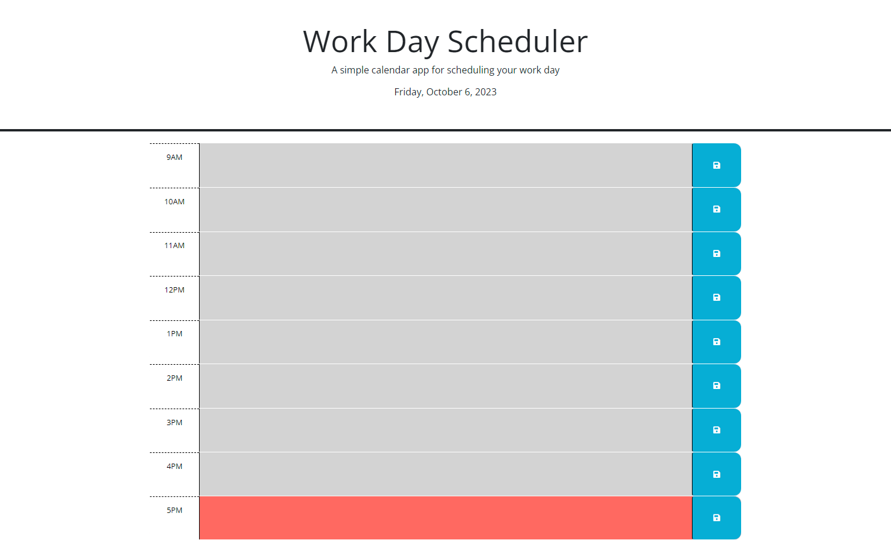

# work-day-scheduler
Module 5 Challenge: Third-Party APIs: Work Day Scheduler

## Purpose
To create a simple calendar application that allows a user to save events for each hour of a working day.

## Link

## Screenshots

## Contributors
Assistance by Tutor: Joem Casusi